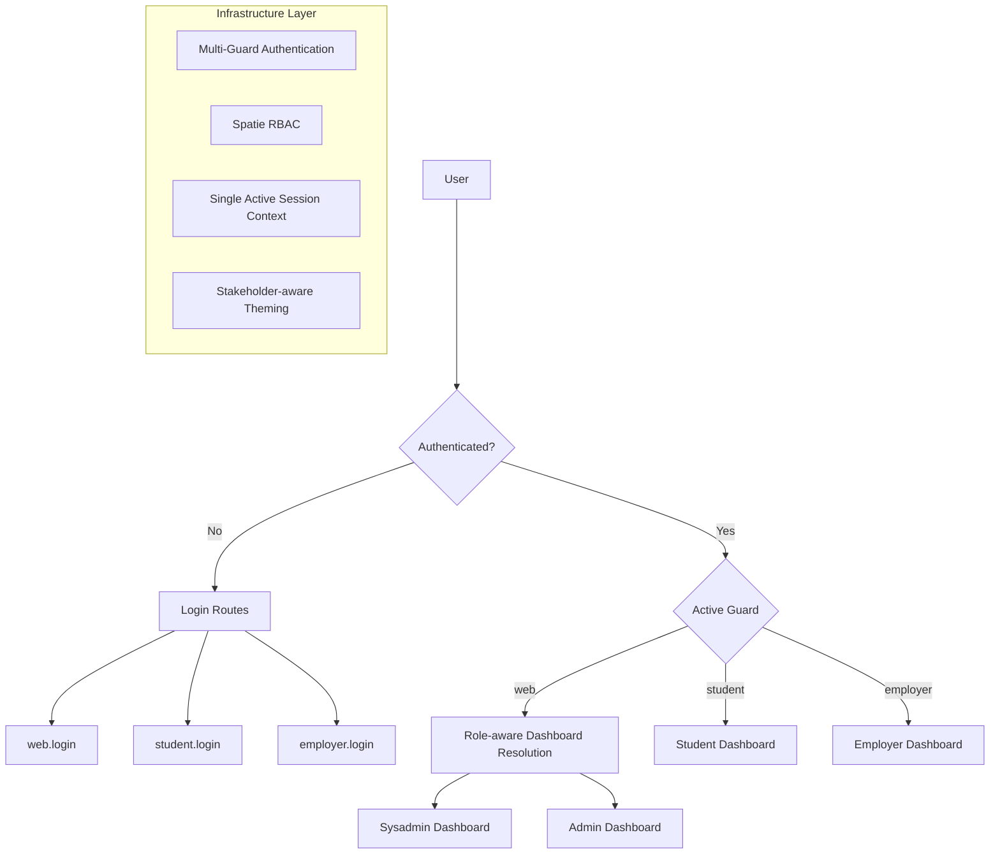

 # Laravel Stakeholder RBAC Infrastructure Artefact

## Research Context

This documentation describes the reusable infrastructure artefact published from a broader research programme.

For the full research lineage, associated publications, and citation details, see:

`docs/resources/research-context.md`

---

## Artefact Overview

This infrastructure artefact provides a minimal but fully functional foundation for stakeholder-aware systems.

The architecture focuses on authentication, authorisation, and infrastructure configuration rather than domain-specific academic features.



---

## Documentation Overview

### Structure

The documentation is organised into clearly separated layers.

#### Architecture

Describes the structural design of the system, including:

- guard-based authentication architecture  
- deterministic guard resolution model  
- dashboard routing strategy  
- theming architecture  
- runtime configuration model  

---

#### Architecture Decision Records (ADRs)

The `decisions/` section documents key architectural decisions made during development.

Examples include:

- multi-guard authentication design  
- single-session enforcement model  
- stakeholder-aware theming approach  
- Vite asset loading strategy  
- containerised development environment

Each ADR records:

- context  
- decision  
- rationale  
- consequences

---

### Developer Notes

The `developer-notes/` section contains practical observations and implementation insights recorded during development.

These notes capture engineering considerations that were encountered while building the infrastructure, including:

- implementation lessons
- framework integration challenges
- configuration considerations
- development-time discoveries

Developer Notes are **informational in nature** and complement the formal architecture and feature documentation. They are included to preserve valuable engineering context for future maintainers.

---

#### Features

The `features/` section documents implemented infrastructure capabilities, including:

- authentication and guard management  
- dashboard resolution  
- session handling
- stakeholder-aware theming
- infrastructure behaviour

Each document in this section describes functionality that is **implemented and operational within the artefact**.

---

#### Operations

Covers runtime and deployment considerations including:

- containerised development environment  
- environment configuration  
- asset compilation  
- operational configuration

---

#### Resources

Provides references and supporting materials related to the system design and implementation.

---

## Relationship to Supplementary Documentation

Additional engineering notes and runtime verification material are located in:

`docs-supplementary/`

This supplementary documentation contains:

- runtime verification evidence
- operational guidance
- engineering observations recorded during development

These documents **support the infrastructure artefact but are not part of the formal system specification**.

---

## How to Read This Documentation

This documentation supports several audiences.

**Academic reviewers**

Begin with:

1. Architecture  
2. Architecture Decision Records (ADRs)

---

**Developers**

Focus on:

1. Features  
2. Architecture

---

**Maintainers / DevOps engineers**

Consult:

1. Operations

---

**Researchers evaluating reproducibility**

Review:

1. Operations  
2. Reference implementation environment documentation

---

## Recommended Reading Order

1. Architecture  
2. ADRs  
3. Features  
4. Operations  
5. Resources  

Supplementary engineering material may then be consulted if needed.

---

## Scope

This repository contains the **reference implementation used for research evaluation**.

It is not intended to represent a production-ready institutional deployment.  
Instead, it provides a **controlled architectural baseline** that demonstrates the infrastructure required to support stakeholder-aware systems.

Future work may extend this infrastructure with additional domain functionality.

A modularised RBAC implementation derived from this work may be released separately as a Composer package.

---

## Reference Implementation Environment

A description of the validated runtime environment  
(PHP, Laravel, MariaDB, Redis, Node, Docker, etc.)  
is available in:

`/docs/operations/environments.md`


This allows the system to be reproduced without embedding environment-specific details into the architecture documentation.

---

## Citation

If you use, adapt, or reference this infrastructure in academic work, please cite:

Bernard, R. (2026).  
_Laravel Stakeholder RBAC Infrastructure Artefact_. Version X.X.  
Zenodo DOI: Pending (will be assigned upon Zenodo release)

---

## BibTeX

```bibtex
@software{bernard_laravel_rbac_infrastructure_2026,
  author    = {Bernard, Rukman},
  title     = {Laravel Stakeholder RBAC Infrastructure Artefact},
  year      = {2026},
  publisher = {Zenodo},
  url       = {https://github.com/rukman-bernard/laravel-stakeholder-rbac-infrastructure}
}
```

---

## License

This project is licensed under the MIT License.

See the `LICENSE` file for details.

```