# Stakeholders

This document defines the stakeholder domains supported by the system and the boundaries between them.

Each stakeholder domain operates within a distinct authentication context.  
Authentication behaviour is defined in:

→ [Authentication & Guards](./auth-and-guards.md)

Authorisation behaviour is defined in:

→ [Authorisation (RBAC)](./authorisation-rbac.md)

---

## Overview

The system currently supports three stakeholder domains:

- internal users
- students
- employers

These domains are isolated through dedicated authentication guards and separate portal entry points.

This isolation ensures that:

- authentication contexts remain separate
- stakeholder-specific access boundaries are preserved
- user experience can be tailored per portal without cross-domain ambiguity

---

## Internal Users

Internal users authenticate under the `web` guard.

This domain includes the following RBAC roles:

- `sysadmin`
- `superadmin`
- `admin`

These users share the same authentication context and are differentiated through Spatie roles and permissions rather than separate guards.

Internal users are responsible for:

- system administration
- application administration
- operational management of protected functionality

Dashboard routing for internal users is role-aware.

See:

- [Authentication & Guards](./auth-and-guards.md)
- [Authorisation (RBAC)](./authorisation-rbac.md)

---

## Students

Students authenticate under the `student` guard.

This domain is isolated from internal users and employers and uses its own authentication context.

At the current stage of the system:

- role-based access control is not applied within the student portal
- separation is achieved through guard isolation and portal-specific routing

Students access only student-specific features and workflows.

---

## Employers

Employers authenticate under the `employer` guard.

This domain is isolated from internal users and students and operates within its own portal context.

At the current stage of the system:

- role-based access control is not applied within the employer portal
- access separation is enforced through guard isolation and employer-specific routing

Employers access only employer-specific features and workflows.

---

## Isolation Model

Each stakeholder domain is treated as a separate security and interaction boundary.

This means:

- a stakeholder account belongs to one authentication context only
- credentials and session state remain isolated by guard
- portal-specific UI behaviour can be resolved after authentication
- cross-domain privilege leakage is structurally reduced

Where a single person requires access to multiple domains, this is handled through separate accounts and separate authentication contexts.

---

## UI and Portal Behaviour

Stakeholder-specific layout and theming behaviour are resolved after authentication based on the active guard and, where applicable, the resolved internal role.

Details of UI resolution and theming are documented in:

- [Theming Strategy](./theming-strategy.md)

---

## Stakeholder Access & Routing Flow

```mermaid
flowchart TB
    U[User] --> G{Authenticated Guard?}

    G -->|student| S[Student Portal]
    G -->|employer| E[Employer Portal]
    G -->|web| W[Internal User Portal]

    S --> SD[/student/dashboard/]
    E --> ED[/employer/dashboard/]

    W --> R{Spatie Role}
    R -->|sysadmin| SYD[/sysadmin/dashboard/]
    R -->|superadmin| AD[/admin/dashboard/]
    R -->|admin| AD[/admin/dashboard/]
```

---

## Related Documents

- [Authentication & Guards](./auth-and-guards.md)
- [Authorisation (RBAC)](./authorisation-rbac.md)
- [Theming Strategy](./theming-strategy.md)
