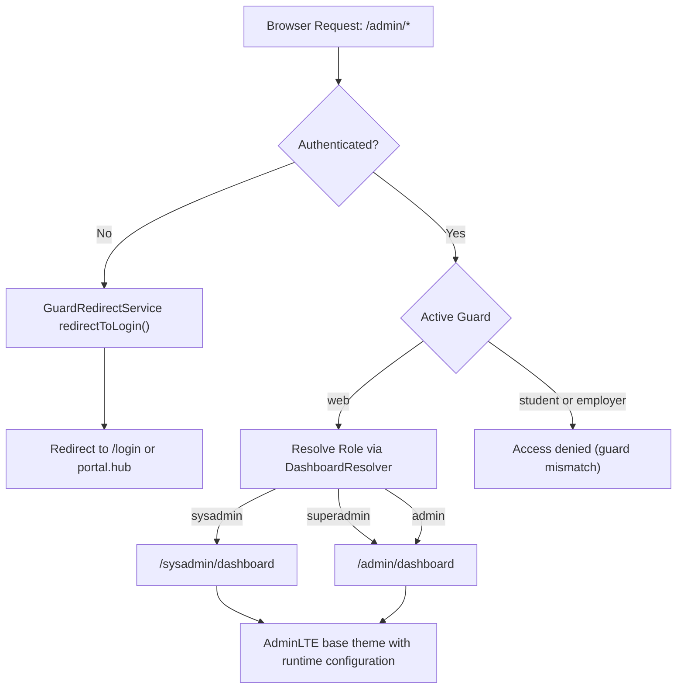
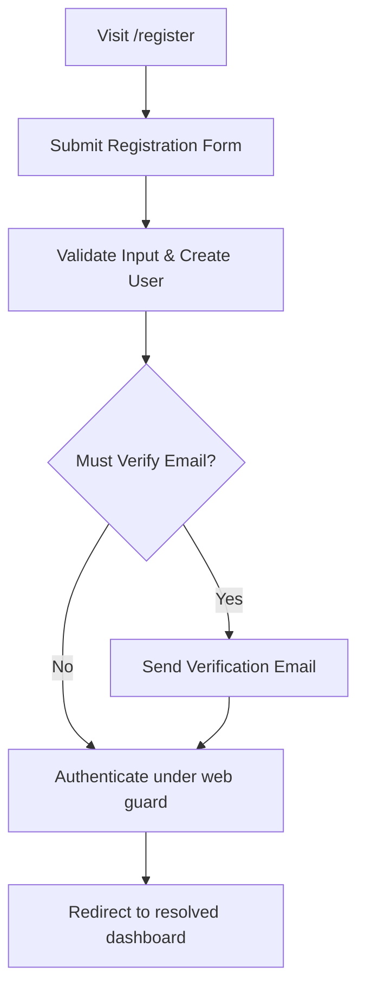
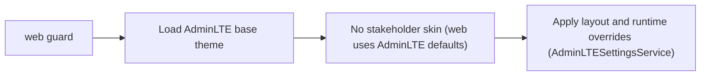
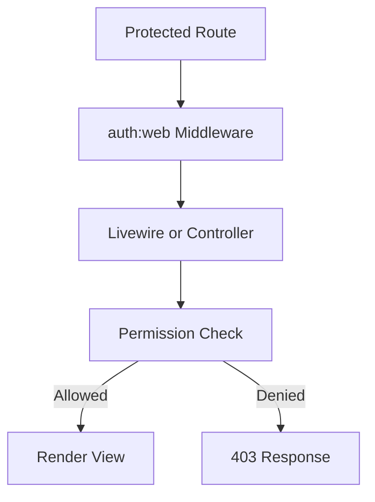

# Admin Portal

## 1. Overview

The **Admin Portal** is the management interface for internal users authenticated under the `web` guard.

It operates within the shared Laravel multi-guard infrastructure and adheres to:

* A **single active authentication context per session**
* Deterministic guard resolution
* Role-based authorisation within the `web` guard
* Service-driven runtime UI configuration
* A shared AdminLTE base theme with layered presentation

The Admin Portal does not introduce a separate authentication context. All internal users authenticate under the `web` guard and are differentiated strictly through roles and permissions.

***

## 2. Internal Users (`web` Guard)

All Admin Portal users authenticate under the `web` guard.
| Role       | Guard | Scope Summary                                                |
|------------|-------|--------------------------------------------------------------|
| sysadmin   | web   | System-level administration and security control             |
| superadmin | web   | Full administrative access (excluding sysadmin-only actions) |
| admin      | web   | Standard administrative operations                           |

Role names are stored via Spatie and evaluated at runtime after guard resolution.

***

## 3. Authentication System

The Admin Portal relies on the system-wide authentication model:

* Multi-guard authentication
* Single active authentication context per session
* Deterministic guard resolution

***

### 3.1 Guard Isolation

Internal users authenticate exclusively under the `web` guard.

Routes under `/admin/*` and `/sysadmin/*` are protected using:
```php
auth:web
```
If an unauthenticated request is received, redirection is performed deterministically via:
```php
App\Services\Auth\GuardRedirectService
```
Redirection is guard-aware and route-aware, with safe redirection to `portal.hub` when required.

Cross-portal access (`student` or `employer`) is blocked deterministically.

***

### 3.2 Single Active Authentication Context

The system enforces a single effective authentication context within the session.

Enforcement mechanisms include:

* `redirect.loggedin` middleware preventing access to guest routes
* Guest-route interception via `RedirectLoggedInToDashboard`
* Deterministic dashboard resolution after authentication

Mixed-guard states are treated as invalid and recoverable via:
```php
auth.reset
```
This recovery route provides a controlled mechanism to reset the session without exposing internal guard logic.

The `web` guard maintains an independent authentication context within the shared Laravel session.
It does not use a separate session store.

***

## 3.3 Registration & Email Verification (`web` Guard)

Internal users register via Laravel’s default authentication scaffolding under the `web` guard.

Registration routes:
```
/register
```
Authentication routes:
```
/login
/password/reset
```
These routes are protected by the `redirect.loggedin` middleware, preventing authenticated users from accessing guest-only pages.

### Registration Behaviour

Registration is handled by Laravel’s standard `RegisterController` and follows the framework’s default flow:

1. Validate incoming credentials

2. Create the `User` model

3. Hash the password using Laravel’s hashing service

4. Authenticate the user under the `web` guard

5. Redirect deterministically to the resolved dashboard

Unlike portal stakeholders (`student`, `employer`), the `web` guard does not require guard-based resolution during registration, as it is the default guard.

***

### Email Verification

If the `User` model implements `MustVerifyEmail`, verification routes are:
```
/email/verify
/email/verify/{id}/{hash}
```
These routes:

* Require `auth:web`
* Are not protected by `redirect.loggedin`
* Prevent redirect loops
* Remain guard-scoped

Unverified users are redirected deterministically to `verification.notice` until verification is completed.

***
### Logout Behaviour (Multi-Guard Aware)

Although registration and authentication for `web` use Laravel’s default scaffolding, logout is handled by a custom multi-guard-aware controller:
```
App\Http\Controllers\Auth\CommonLogoutController
```
This implementation:

* Invalidates the session
* Regenerates the CSRF token
* Clears the active authentication context across all configured session guards

This ensures logout behaviour remains consistent across:

* `web`

* `student`

* `employer`

No cross-portal authentication state persists after logout.

***

## 4. Authorisation Layer (RBAC)

Authorisation within the Admin Portal is implemented using **Spatie Roles & Permissions**.

Guard resolution occurs first.
Role resolution occurs second.
Permission enforcement occurs third.

This ordering is deterministic.
***

### 4.1 Role Resolution

Role resolution for `web` users is handled via:
```php
App\Services\Auth\DashboardResolver
```
The user’s effective role determines dashboard routing and feature availability.

Resolution is configuration-driven and deterministic.

There is no guard-priority behaviour.

***

### 4.2 Permission Enforcement

Permissions control access to:

* Administrative features
* CRUD operations
* System configuration
* Role and permission management
* `sysadmin`-restricted operations

Enforcement layers include:

* Route middleware
* Livewire or controller-level authorisation
* Blade visibility checks

The `AuthorizesWithPermissions` trait standardises component-level enforcement and ensures consistent 403 handling.

UI visibility enhances usability.
Server-side permission checks remain authoritative.

***

## 5. Dashboard Resolution

Dashboard routing within the Admin Portal is guard-scoped and role-driven.
| Role       | Dashboard Route      |
|------------|----------------------|
| sysadmin   | /sysadmin/dashboard  |
| superadmin | /admin/dashboard     |
| admin      | /admin/dashboard     |

Routing is resolved via:
```php
App\Services\Auth\DashboardResolver
```
If a configured dashboard route is invalid or unavailable, the system redirects to `auth.reset`.

Dashboard routing remains consistent across:

* Direct URL access
* Post-login redirection
* Guest-route interception
* Session restoration

***

## 6. Presentation Architecture

The Admin Portal uses the shared **AdminLTE base theme**.

There are currently no role-specific skins.

Presentation layering follows deterministic configuration:

1. AdminLTE base theme loads first.

2. Runtime configuration applies layout and navigation settings.

***

### 6.1 Runtime Configuration

Runtime configuration is applied via:
```php
App\Services\AdminLTE\AdminLTESettingsService
```
For the `web` guard, this service:

* Detects the active guard
* Resolves the user’s role
* Sets the dashboard URL
* Applies layout options
* Applies guard-level runtime overrides

Configuration executes prior to controller rendering for GET requests, ensuring consistent UI state.

***

### 6.2 AdminLTE User Interface Integration

User dropdown presentation is standardised via:
```php
App\Traits\AdminLteUserInterface
```
This trait:

* Resolves the primary role label (if roles exist)
* Falls back to guard label when roles are not present
* Provides profile URL resolution
* Provides avatar image resolution
* Supplies dropdown description text

This ensures consistent role and guard labelling across all stakeholder types.

***

## 7. Navigation Control

Menu visibility is permission-driven.

Examples:

* `view users`

* `view roles`

* `view permissions`

* `create programmes`

Menu sections render conditionally based on permission checks.

No navigation element is rendered without corresponding server-side authorisation.

***

## 8. Security Boundaries

The Admin Portal enforces:

* Guard isolation (`web` vs `student` vs `employer`)
* Deterministic guard resolution
* Single active authentication context
* Role-based authorisation within `web`
* Controlled recovery via `auth.reset`
* Server-side permission enforcement

Sensitive operations remain restricted to `sysadmin`.

***

## 9. Extensibility

The Admin Portal supports extension without architectural modification:

* Additional roles within `web`
* Additional permission sets
* Optional role-aware theming
* External authentication integration
* Feature toggles

Extensions operate within the existing authentication and authorisation model and do not introduce new guard contexts.

***

## Admin Portal — Resolution Flow Diagrams

***

### Diagram 1: Admin Route Access


---
### Diagram 2: Admin Registration Flow (`web` Guard)


---
### Diagram 3: Theming Application (Admin)

---

### Diagram 4: RBAC Enforcement Layers


---
## Related Documentation
- [Authentication & Guards](../architecture/auth-and-guards.md)
- [Authorisation (RBAC)](../architecture/authorisation-rbac.md)
- [Session Management](./session-management.md)
- [Theming Strategy](../architecture/theming-strategy.md)
- [ADR-002: Multi-Guard Authentication ](../decisions/ADR-002-multi-guard-auth.md)


