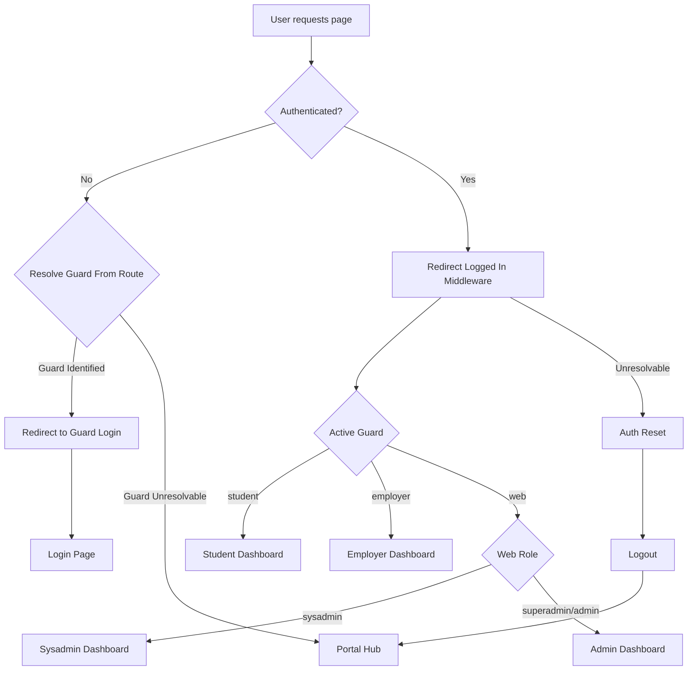

# Authentication Feature

This document describes the **authentication feature set** of the system from a functional perspective. It explains how users authenticate, how authentication contexts are isolated, and how users are routed into the correct portal after login.

For architectural details and design rationale, see:
- [`architecture/Authentication & Guards`](../architecture/auth-and-guards.md)
- [`architecture/Authorisation (RBAC)`](../architecture/authorisation-rbac.md)

---

## Feature Overview

The system supports **multi-stakeholder authentication** using Laravel’s multi-guard mechanism. Each stakeholder group authenticates through a dedicated guard, ensuring strict separation between portals and authentication contexts.

The authentication feature ensures:

- Users can only access their intended portal
- Cross-portal session leakage is prevented
- A single active authentication context per browser session
- The system is extensible to new stakeholders with minimal changes

---

## Supported Authentication Contexts

### Internal User Authentication (`web` guard)

- Used by internal users: **sysadmin**, **superadmin**, and **admin**
- Authenticates against the `users` table
- Role-based routing determines dashboard access
- Authorisation is enforced using Spatie Roles & Permissions

---

### Student Authentication (`student` guard)

- Used exclusively for students
- Authenticates against the `students` table
- Isolated from internal users and employer authentication
- Grants access only to the student portal

---

### Employer Authentication (`employer` guard)

- Used exclusively for employers
- Authenticates against the `employers` table
- Isolated from internal users and student authentication
- Grants access only to the employer portal

---

## Password Reset (Per Guard)

Password reset is supported per guard so that reset links and token storage remain isolated between stakeholder domains.

This prevents cross-portal reset confusion and ensures users always reset credentials within the correct authentication context.

---

## Login Flow Behaviour

1. A user attempts to access a protected route.
2. The system inspects the current authentication state.
3. If no authenticated guard is found:
    * The system attempts to resolve the guard based on the requested route.
    * If resolvable, the request is redirected to the corresponding login page.
    * If not resolvable, the request is redirected to the portal hub.

4. After successful authentication:
   - The active guard is resolved deterministically.
   - If a valid dashboard can be resolved, the user is redirected accordingly.
   - If a dashboard cannot be safely resolved, the request is routed to the recovery flow (`auth.reset`).

This logic ensures users are never routed into an incorrect or ambiguous portal state.

---

## Guard-Aware Redirection

The authentication system includes a guard-aware redirect mechanism that:

- Detects which guard is relevant for the request
- Redirects unauthenticated users to the correct login page
- Prevents generic redirects that could cause ambiguity or security issues

Examples:

- Internal users → `/login`
- Student → `/student/login`
- Employer → `/employer/login`

---

## Session Isolation

Each guard defines an independent authentication context. Under the enforced single-session model, only one context is treated as effective at runtime.

This ensures:

- A logged-in student cannot access internal user routes
- A logged-in employer cannot access the student portal
- Internal users must explicitly authenticate under the `web` guard

Guard resolution logic ensures cross-portal access is not possible.

---

## Single-Session Behaviour (User Experience)

To provide predictable and safe behaviour, the system enforces **a single active authentication context per browser session**.

### Primary Enforcement

- Authenticated users cannot access guest routes (login, registration, password reset).
- Requests to guest pages are redirected to the resolved dashboard.

### Defensive Safeguard

- If a login attempt occurs while another guard is unexpectedly authenticated within the same session, the existing session is invalidated before processing the new login.

Together, these mechanisms ensure:

- Only one guard is active per session
- Mixed-guard states are treated as invalid
- Authentication behaviour remains deterministic and recoverable

---

## Guest Entry Points and Redirect Safety

### Guest-Protected Entry Hub (`portal.hub`)

`portal.hub` serves as the primary unauthenticated entry point.

- Protected by `redirect.loggedin` middleware
- Redirects authenticated users to their resolved dashboard
- Presents portal options to guests

---

### Redirect-Loop Escape Route (`auth.reset`)

To recover from rare authentication edge cases, the system defines a session recovery route named `auth.reset`.

- Accessible only to authenticated users
- Excluded from `redirect.loggedin` enforcement
- Used when a dashboard cannot be safely resolved

The route provides a controlled recovery mechanism, typically offering a logout action to reset session state.

This prevents:

- Infinite redirect loops
- Dead-end navigation states
- Session lock-in due to partial authentication failures

---

## Authentication Enforcement Points

Authentication is enforced at multiple layers:

- **Route middleware** — restricts protected routes
- **Global authentication middleware** — applies guard-aware redirect logic
- **Livewire components** — enforce server-side authentication checks

UI visibility is never relied upon for security.  
Server-side authentication is the source of truth.

---

## Authentication Flow Diagram

---
## Extensibility

Adding a new authentication context requires:

* Defining a new guard, provider, and password broker

* Registering routes and login endpoints

* Optionally assigning a stakeholder skin

Existing authentication logic remains unchanged.

---
## Summary

* Authentication is guard-based, not role-based

* Guards define who is logged in and which portal they belong to

* Role-based access control is layered on top where required

* Session isolation prevents cross-portal access

* The system is designed for safe and deterministic extension

For access control rules and permissions, see:
- **[Authorisation (RBAC)](../architecture/authorisation-rbac.md)**

