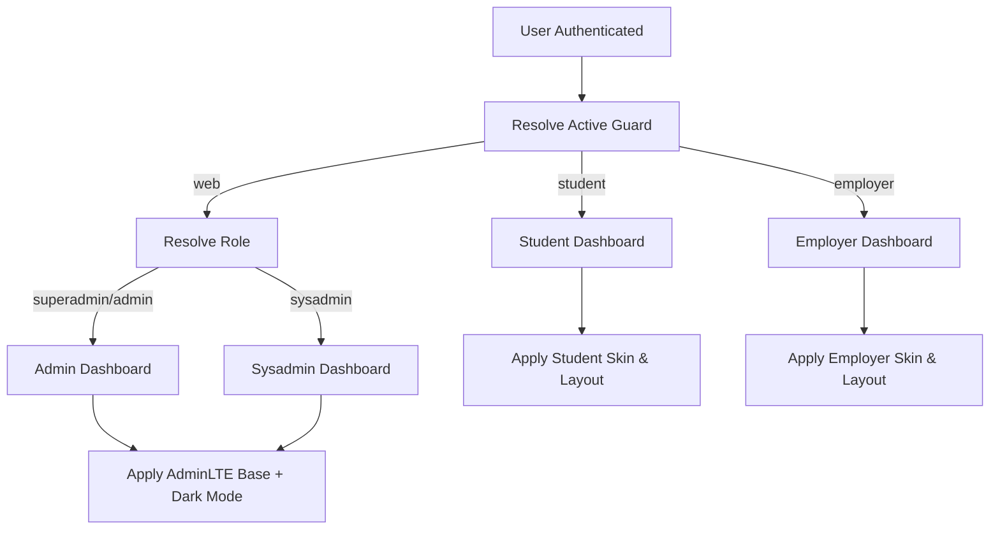

# Dashboards Feature

This document describes how dashboards are designed, resolved, and presented across the system. Dashboards act as the primary entry point after authentication and deliver a guard-aware, role-aware, and theme-aware experience.

---

## Purpose

Dashboards provide:

- A clear landing point after login, password reset, or session restore
- Context-appropriate UI based on authentication guard
- Role-based separation for internal users
- A consistent experience under the single-session authentication model

Dashboard resolution is handled centrally to improve security, maintainability, and extensibility.

---

## Dashboard Types

### Internal User Dashboards (`web` guard)

Internal users authenticate under the `web` guard and are differentiated using Spatie roles.

| Role        | Dashboard Route            |
|-------------|----------------------------|
| sysadmin    | `/sysadmin/dashboard`      |
| superadmin  | `/admin/dashboard`         |
| admin       | `/admin/dashboard`         |

Superadmin and admin share the same dashboard unless explicitly separated in future requirements.

---

### Student Dashboard (`student` guard)

- Route: `/student/dashboard`
- Layout: Top-navigation layout
- Skin: Student skin (CSS or SCSS)
- Scope: Academic progress, modules, announcements

---

### Employer Dashboard (`employer` guard)

- Route: `/employer/dashboard`
- Layout: Top-navigation layout
- Skin: Employer skin
- Scope: Engagement and opportunity management

---

## Dashboard Resolution Strategy

Dashboard resolution follows a centralised and deterministic flow:

1. Detect the active authentication guard
2. Resolve the appropriaauth-and-guards.mdte dashboard route
3. Apply role-based logic (for `web` guard)
4. Apply runtime presentation configuration
5. Render the dashboard

This logic is centralised to avoid duplication across controllers and middleware.

---

## Guard Detection & Deterministic Resolution

Under the single-session authentication model, only one guard is expected to be active per session.

The system:

- Resolves the active guard deterministically
- Applies role resolution only within the `web` guard
- Treats ambiguous or conflicting guard states as invalid
- Routes unresolved states to the controlled recovery flow (`auth.reset`)

This prevents:

- Conflicting dashboards
- UI leakage between portals
- Ambiguous redirects

---

## Routing Model

Dashboard routes are resolved centrally using:

- Guard-based mappings (for `student`, `employer`)
- Role-based resolution within the `web` guard
- `config/nka.php` dashboard route definitions

No controllers contain hardcoded dashboard redirects.

This ensures consistent behaviour across:

- Login
- Logout
- Password reset
- Session restoration

---

## Presentation & Theming

Dashboard presentation is configured dynamically using `AdminLTESettingsService`.

### Runtime Configuration Includes:

- Dashboard URL
- Title postfix
- Layout mode (sidebar vs top-navigation)
- Dark/light mode
- Optional body classes for SCSS skin activation

All stakeholders share the same AdminLTE structural foundation. Layout mode and visual differentiation are applied dynamically at runtime.  
Visual differentiation is applied through layered skins and runtime configuration.

---

## Security & UX Guarantees

The dashboards feature guarantees:

- One active dashboard per session
- Guard-isolated portals
- Role-controlled internal access
- Predictable post-authentication redirects
- No cross-portal session leakage

UI visibility is treated as a convenience layer only.  
All enforcement occurs server-side.

---

## Dashboard Resolution Flow

## Related Documentation

- [Authentication & Guards](../architecture/auth-and-guards.md)
- [Authorisation (RBAC)](../architecture/authorisation-rbac.md)
- [Theming Strategy](../architecture/theming-strategy.md)
- [Admin Portal](admin-portal.md)
- [Student Portal](student-portal.md)
- [Employer Portal](employer-portal.md)
