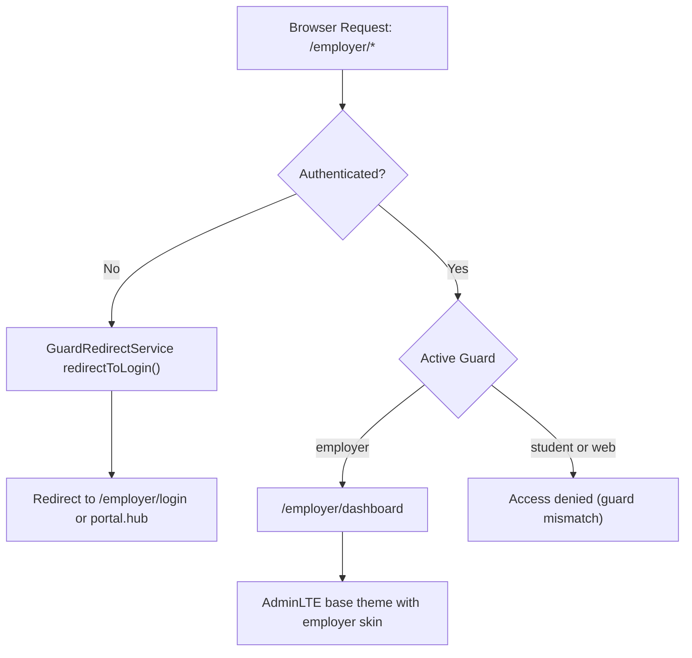
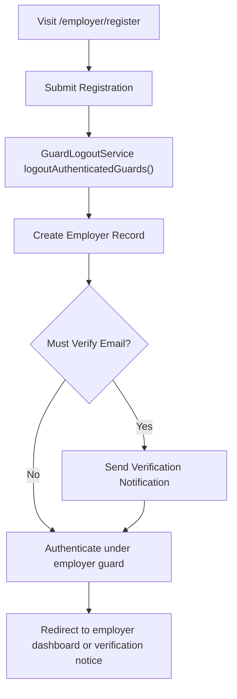
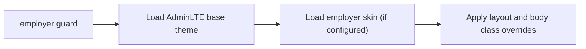

# Employer Portal

## 1. Overview

The **Employer Portal** is the stakeholder-facing interface for users authenticated under the `employer` guard.

It operates within the shared multi-guard authentication infrastructure and adheres to:

* A **single active authentication context per session**
* Deterministic guard resolution
* Guard-scoped routing
* Shared AdminLTE base theme
* Layered stakeholder-specific presentation

The Employer Portal does not introduce a separate authentication system. It relies on guard isolation within the shared infrastructure.

***

## 2. Stakeholder Context
| Stakeholder | Guard    | Purpose                                           |
|-------------|----------|---------------------------------------------------|
| Employer    | employer | Access employer-facing services and interactions  |

Employers authenticate exclusively under the `employer` guard.

***

## 3. Authentication System

### 3.1 Guard Isolation

All employer routes are prefixed with `/employer/*` and protected using:
```php
auth:employer
```
Guard isolation ensures:

* Employers cannot access `web` routes
* Employers cannot access `student` routes
* Cross-portal access is deterministically blocked

Guard detection is performed via:
```php
App\Services\Auth\GuardResolver
```
***

### 3.2 Single Active Authentication Context

The system enforces a single effective authentication context per session.

Enforcement mechanisms include:

* `redirect.loggedin` middleware preventing access to guest routes once authenticated
* Deterministic redirect resolution
* Mixed-guard states are treated as invalid and recoverable deterministically via `auth.reset`.

The `employer` guard maintains an independent authentication context within the shared Laravel session. It does not use a separate session store.

***

### 3.3 Registration Behaviour

Employer registration is implemented via:
```php
App\Http\Controllers\Portal\Auth\PortalRegisterController
```
Registration flow:

1. Guard is resolved from the URL prefix.

2. Validation is performed against the guard’s provider table.

3. `GuardLogoutService::logoutAuthenticatedGuards()` executes to enforce single-session behaviour.

4. The employer record is created.

5. Email verification notification is dispatched (if required).

6. Authentication occurs under the `employer` guard.

7. Redirection resolves deterministically to the employer dashboard.

This guarantees:

* No mixed-guard authentication state
* Deterministic post-registration routing
* Infrastructure-level consistency across stakeholders

***

### 3.4 Email Verification

Employer verification routes:
```php
/employer/email/verify
/employer/email/verify/{id}/{hash}
```
These routes:

* Require `auth:employer`
* Are not protected by `redirect.loggedin`
* Prevent redirect loops
* Remain guard-scoped

***
## Logout Behaviour (Multi-Guard Aware)

Logout for employers is handled by the shared multi-guard-aware controller:
```PHP
App\Http\Controllers\Auth\CommonLogoutController
```

This implementation:

* Invalidates the session
* Regenerates the CSRF token
* Clears the active authentication context across all configured session guards

Although employers authenticate under the `employer` guard, logout is unified across:

* `web`

* `student`

* `employer`

This ensures:

* No mixed authentication state persists
* Cross-portal state is cleared deterministically
* Session behaviour remains consistent across stakeholders

---

## 4. Authorisation Model

At present, the Employer Portal relies primarily on **guard isolation** rather than role-based authorisation.

All authenticated employers have equivalent access within the employer portal.

If future requirements introduce delegated access, employer managers, or sub-accounts, Spatie RBAC can be extended to the `employer` guard without altering the authentication system.

***

## 5. Dashboard Resolution

Employer dashboard route:
```php
/employer/dashboard
```
Dashboard resolution is guard-driven and configured via:
```php
App\Services\Auth\DashboardResolver
```
If dashboard configuration drift occurs, resolution falls back deterministically to `auth.reset`.

The dashboard is:

* Guard-scoped
* Presentation-aware
* Runtime-configured
***

## 6. Presentation Architecture

### 6.1 Base Theme

The Employer Portal uses the shared **AdminLTE base theme**.

Presentation layering follows deterministic stylesheet ordering:

1. AdminLTE base loads first.

2. Employer skin loads afterward.

This relies on **CSS cascade behaviour**, not a fallback engine.

***

### 6.2 Employer Skin Configuration

Skin configuration is defined in:
```php
config/nka.php
```
Example:
```php
'employer' => 'resources/css/skins/employer.css',
```
If no skin entry exists, only the AdminLTE base theme is applied.

There is no dynamic theming engine.

***

### 6.3 Runtime Configuration

Runtime UI configuration is applied via:
```php
App\Services\AdminLTE\AdminLTESettingsService
```
For the `employer` guard, configuration includes:

* Top-navigation layout
* Guard-specific body classes
* Layout overrides

Runtime configuration executes prior to rendering.

***

## 7. Portal Entry Points

Employer guest routes (protected by `redirect.loggedin`):

* `/employer/login`

* `/employer/register`

* `/employer/password/reset`

Authenticated routes:

* `/employer/dashboard`

* POST : `/logout`

* `/employer/email/verify`

All routes are guard-scoped and deterministically resolved.

***

## 8. Security Boundaries

The Employer Portal enforces:

* Guard isolation (`employer` vs `student` vs `web`)
* Single active authentication context
* Deterministic redirect handling
* Controlled recovery via `auth.reset`
* Server-side route protection

Employers cannot access internal user or student routes.

***

## 9. Extensibility

The Employer Portal can be extended without modifying the authentication system:

* Employer sub-roles
* Delegated accounts
* Multi-user employer organisations
* Additional dashboards
* Additional skins

All extensions remain compatible with the single-session model.

---
## Employer Portal — Resolution Diagrams

***
### Diagram 1: Employer Route Access


---
### Diagram 2: Employer Registration Flow


---
### Diagram 3: Theming Application (Employer)


---
## Related Documentation
- [ Authentication Feature](../features/authentication.md)
- [Authentication & Guards](../architecture/auth-and-guards.md)
- [Session Management](./session-management.md)
- [Theming Strategy](../architecture/theming-strategy.md)
- [ADR-004: Stakeholder-Specific Theming](../decisions/ADR-004-stakeholder-theming.md)
