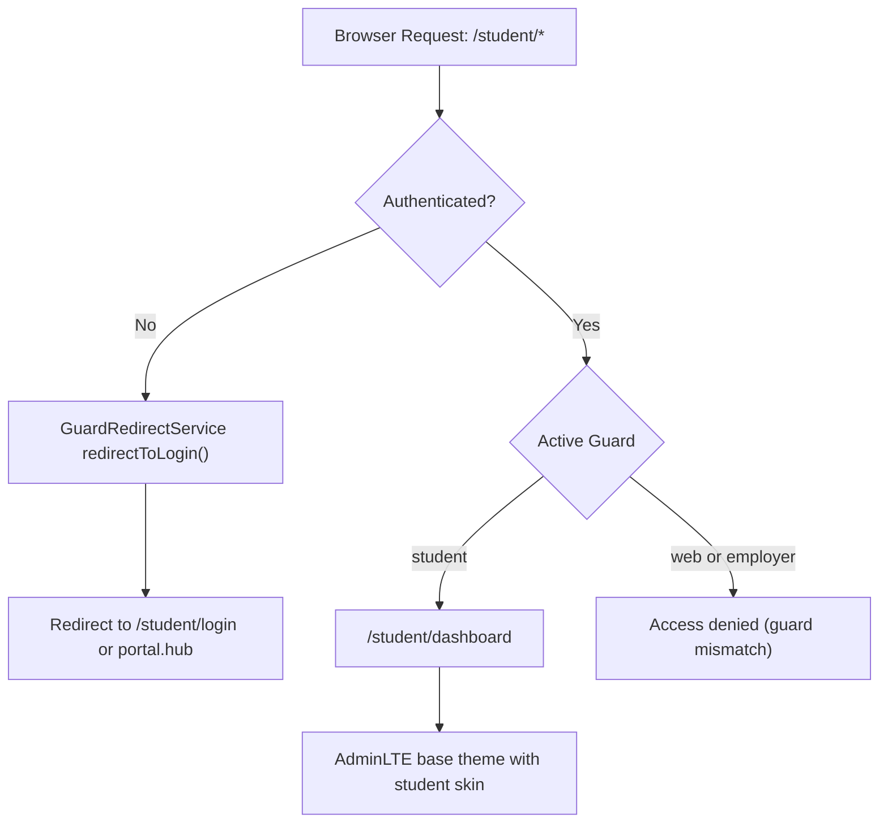
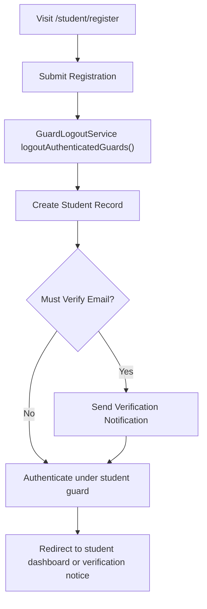
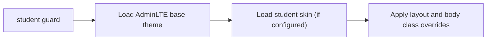

# Student Portal

## 1. Overview

The **Student Portal** is the learner-facing interface for users authenticated under the `student` guard.

It operates within the system’s multi-guard authentication infrastructure and adheres to the following architectural principles:

* A **single active authentication context per session**
* Deterministic guard resolution
* Guard-scoped routing
* Shared AdminLTE base theme
* Layered stakeholder-specific presentation

The Student Portal does not introduce a separate authentication system. It relies on guard isolation within the shared infrastructure.

***

## 2. Stakeholder Context
| Stakeholder | Guard   | Purpose                                                      |
|-------------|---------|--------------------------------------------------------------|
| Student     | student | Access academic and community services through a learner-focused interface |

Students authenticate exclusively under the `student` guard.

***

## 3. Authentication System

### 3.1 Guard Isolation

All student routes are prefixed with `/student/*` and protected using:
```php
auth:student
```
Guard isolation ensures:

* Students cannot access `web` routes
* Students cannot access `employer` routes
* Cross-portal access is deterministically blocked

Guard detection is performed via:
```php
App\Services\Auth\GuardResolver
```
---
### 3.2 Single Active Authentication Context

The system enforces a single effective authentication context per session.

Enforcement mechanisms include:

* `redirect.loggedin` middleware preventing access to guest routes once authenticated
* `RedirectLoggedInToDashboard` intercepting guest pages
* Mixed-guard states are treated as invalid and recoverable deterministically via `auth.reset`.


The Student Portal does not maintain an independent session store. The `student` guard maintains an independent authentication context within the shared Laravel session.

***

### 3.3 Registration Behaviour

Student registration is implemented via:
```php
App\Http\Controllers\Portal\Auth\PortalRegisterController
```
Registration flow:

1. Guard is resolved from the URL prefix.

2. Validation is performed against the guard’s provider table.

3. `GuardLogoutService::logoutAuthenticatedGuards()` is executed to enforce single-session behaviour.

4. The new student record is created.

5. Email verification notification is dispatched (if required).

6. The user is authenticated under the `student` guard.

7. Redirection occurs deterministically to the student dashboard.

This guarantees that:

* A student registration cannot coexist with another active guard context.
* Authentication context remains deterministic.
* No cross-portal state persists.

***

### 3.4 Email Verification

Student email verification routes are:
```php
/student/email/verify
/student/email/verify/{id}/{hash}
```
These routes:

* Require `auth:student`
* Are not protected by `redirect.loggedin`
* Prevent redirect loops
* Maintain deterministic guard scoping

***
## Logout Behaviour (Multi-Guard Aware)

Logout for students is handled by the shared multi-guard-aware controller:
```php
App\Http\Controllers\Auth\CommonLogoutController
```
This implementation:

* Invalidates the session
* Regenerates the CSRF token
* Clears the active authentication context across all configured session guards

Although students authenticate under the `student` guard, logout is unified across:

* `web`

* `student`

* `employer`

This ensures:

* No mixed authentication state persists
* Cross-portal state is cleared deterministically
* Session behaviour remains consistent across stakeholders

---


## 4. Authorisation Model

At present, the Student Portal relies primarily on **guard isolation** rather than role-based authorisation.

All access control is enforced through:

* Guard-scoped routing
* Route middleware
* Component-level checks where required

If future requirements introduce student sub-roles, RBAC can be extended to the `student` guard without altering the authentication system.

***

## 5. Dashboard Resolution

The student dashboard route:
```php
/student/dashboard
```
Dashboard resolution is guard-driven and configured via:
```php
App\Services\Auth\DashboardResolver
```
If dashboard configuration drift occurs, resolution falls back deterministically to `auth.reset`.

The dashboard is:

* Guard-scoped
* Presentation-aware
* Runtime-configured

***

## 6. Presentation Architecture

### 6.1 Base Theme

The Student Portal uses the shared **AdminLTE base theme**.

Presentation layering follows deterministic stylesheet ordering:

1. AdminLTE base loads first.

2. Student skin loads afterward.

This relies on CSS cascade behaviour rather than fallback logic.

***

### 6.2 Student Skin Configuration

Student skin configuration is defined in:
```php
config/nka.php
```
Example:
```php
'student' => 'resources/scss/skins/student/student.scss',
```
If a skin entry is absent, only the AdminLTE base theme is applied.

There is no theming engine or dynamic fallback system.

***

### 6.3 Runtime Configuration

Runtime UI configuration is applied via:
```php
App\Services\AdminLTE\AdminLTESettingsService
```
For the `student` guard, this includes:

* Top-navigation layout mode
* Guard-specific body class (`glassmorphism-theme`)
* Layout overrides

Runtime configuration executes for GET requests before rendering.

***

## 7. Portal Entry Points

Student guest routes (protected by `redirect.loggedin`):

* `/student/login`

* `/student/register`

* `/student/password/reset`

Authenticated routes:

* `/student/dashboard`

* POST : `/logout`

* `/student/email/verify`

All routes are guard-scoped and deterministically resolved.

***

## 8. Security Boundaries

The Student Portal enforces:

* Guard isolation (`student` vs `web` vs `employer`)
* Single active authentication context
* Deterministic redirect handling
* Controlled recovery via `auth.reset`
* Server-side route protection

Students cannot access internal user or employer routes under any circumstance.

***

## 9. Extensibility

The Student Portal can be extended without altering the authentication system:

* Student sub-roles
* Alumni pathways
* Programme-specific dashboards
* Additional skins
* Feature modules

Extensions remain guard-scoped and compatible with the single-session model.

***

## Student Portal — Resolution Diagrams

---
### Diagram 1: Student Route Access


---
### Diagram 2: Student Registration Flow


---
### Diagram 3: Theming Application (Student)


---
## Related Documentation
- [ Authentication Feature](../features/authentication.md)
- [Authentication & Guards](../architecture/auth-and-guards.md)
- [Session Management](./session-management.md)
- [Theming Strategy](../architecture/theming-strategy.md)
- [ADR-005: Student Portal Layout ](../decisions/ADR-005-student-portal-layout.md)

